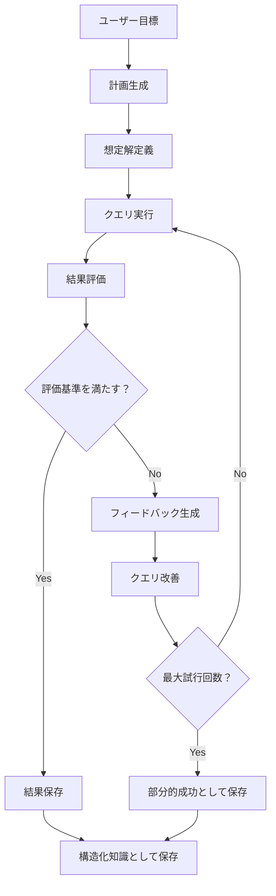

# Gistdex クエリ計画ワークフロー実装提案

## 背景と課題

### 現状の問題点

現在の Gistdex MCP ツールには`useChain`と`saveStructured`オプションが存在しますが、LLM エージェントがクエリを実行する際に以下の課題があります：

1. **計画性の欠如**：クエリ実行前に明確な計画を立てていない
2. **評価基準の不在**：結果の良し悪しを判断する基準が曖昧
3. **改善サイクルの欠如**：期待と異なる結果が得られても自動的な改善が行われない
4. **思考プロセスの不可視性**：LLM の判断過程が追跡できない

### ユーザー要求

LLM エージェントに以下のワークフローを強制したい：

1. どのようなクエリをかければ、ユーザーの依頼を達成できるか事前に考える
2. クエリによる想定解を用意する
3. クエリをかける
4. クエリ結果と想定解を比較し、乖離がないか把握する
5. 想定解に近くなるまで 3~4 を繰り返す
6. 結果が得られたら.gistdex/cache 配下へ記載する

このワークフローを、「クエリ計画」と呼ぶ。

## 実装設計

### 1. 新規 MCP ツール: `gistdex_query_plan`

#### 概要

クエリ計画の立案、実行、評価、改善、キャッシングを統合的に管理する MCP ツール。

#### 入力スキーマ

```typescript
interface QueryPlanInput {
  // 必須パラメータ
  goal: string; // ユーザーの最終目標（例："VitePressの設定方法を理解する"）

  // オプションパラメータ
  initialQueries?: string[]; // 初期クエリ候補
  maxIterations?: number; // 最大試行回数（デフォルト: 5）
  evaluationMode?: "strict" | "fuzzy" | "semantic"; // 評価モード
  saveIntermediateResults?: boolean; // 中間結果も保存するか（デフォルト: true）
  timeoutSeconds?: number; // タイムアウト秒数（デフォルト: 120、最小: 10、最大: 300）

  // 評価基準の定義
  expectedResults?: {
    keywords?: string[]; // 必須キーワード
    minMatches?: number; // 最小マッチ数
    contentPatterns?: string[]; // 期待されるコンテンツパターン
    confidence?: number; // 信頼度閾値（0-1）
  };

  // 高度な設定
  strategy?: {
    initialMode: "broad" | "specific"; // 初回クエリの戦略
    refinementMethod: "keywords" | "semantic" | "hybrid"; // 改善方法
    expansionRules?: string[]; // クエリ拡張ルール
  };

  // データベース設定（Phase 2で追加）
  provider?: string; // ベクターデータベースプロバイダー
  db?: string; // データベースファイルパス
}
```

#### 出力フォーマット

```typescript
interface QueryPlanResult {
  planId: string; // 計画ID（UUID）
  goal: string; // 最終目標
  status: "success" | "partial" | "failed"; // 実行結果

  // 実行履歴
  iterations: Array<{
    iterationNumber: number;
    query: string;
    expectedKeywords: string[];
    actualResults: SearchResult[];
    evaluationScore: number;
    feedback: string;
    refinements: string[];
  }>;

  // 最終結果
  finalResults: {
    data: SearchResult[];
    confidence: number;
    matchedExpectations: string[];
    unmatchedExpectations: string[];
  };

  // メタデータ
  metadata: {
    totalIterations: number;
    totalTime: number;
    cacheHits: number;
    improvementRate: number;
  };

  // 保存情報
  savedAt: string; // .gistdex/cache/plans/{planId}.json
  structuredKnowledgePath?: string; // .gistdex/cache/{topic}.md
}
```

### 2. コア実装モジュール

#### 2.1 `src/mcp/utils/query-planner.ts`

```typescript
// クエリ計画の生成と管理
export interface QueryPlan {
  id: string;
  goal: string;
  stages: PlanStage[];
  evaluationCriteria: EvaluationCriteria;
  status: PlanStatus;
}

export interface PlanStage {
  stageNumber: number;
  description: string;
  query: string;
  expectedResults: ExpectedResult;
  actualResults?: SearchResult[];
  evaluation?: StageEvaluation;
}

export interface ExpectedResult {
  keywords: string[];
  patterns: RegExp[];
  minConfidence: number;
  minMatches: number;
}

export class QueryPlanner {
  // 目標から計画を生成
  generatePlan(goal: string, options?: PlanOptions): QueryPlan;

  // 計画を実行
  executePlan(plan: QueryPlan): Promise<QueryPlanResult>;

  // ステージを評価
  evaluateStage(stage: PlanStage): StageEvaluation;

  // クエリを改善
  refineQuery(
    query: string,
    evaluation: StageEvaluation,
    feedback: string,
  ): string;

  // 計画を保存
  savePlan(plan: QueryPlan, results: QueryPlanResult): Promise<void>;
}
```

#### 2.2 `src/mcp/utils/result-evaluator.ts`

```typescript
// 結果評価エンジン
export interface EvaluationMetrics {
  keywordMatch: number; // キーワード一致率（0-1）
  patternMatch: number; // パターン一致率（0-1）
  semanticSimilarity: number; // 意味的類似度（0-1）
  coverage: number; // カバレッジ（0-1）
  precision: number; // 精度（0-1）
  recall: number; // 再現率（0-1）
}

export class ResultEvaluator {
  // 結果を評価
  evaluate(actual: SearchResult[], expected: ExpectedResult): EvaluationMetrics;

  // フィードバックを生成
  generateFeedback(
    metrics: EvaluationMetrics,
    expected: ExpectedResult,
  ): string;

  // 改善提案を生成
  suggestImprovements(
    query: string,
    metrics: EvaluationMetrics,
    results: SearchResult[],
  ): string[];

  // スコアを計算
  calculateScore(metrics: EvaluationMetrics): number;
}
```

#### 2.3 `src/mcp/tools/query-plan-tool.ts`

```typescript
// MCPツールハンドラー
export const handleQueryPlanTool = createToolHandler(
  queryPlanSchema,
  async (data: QueryPlanInput) => {
    const planner = new QueryPlanner();
    const evaluator = new ResultEvaluator();

    // 1. 計画生成
    const plan = planner.generatePlan(data.goal, {
      expectedResults: data.expectedResults,
      strategy: data.strategy,
    });

    // 2. 反復実行
    let iteration = 0;
    let bestScore = 0;
    let bestResults: SearchResult[] = [];

    while (iteration < data.maxIterations) {
      // クエリ実行
      const results = await executeQuery(plan.stages[iteration].query);

      // 評価
      const metrics = evaluator.evaluate(
        results,
        plan.stages[iteration].expectedResults,
      );
      const score = evaluator.calculateScore(metrics);

      // 最良結果の更新
      if (score > bestScore) {
        bestScore = score;
        bestResults = results;
      }

      // 終了条件チェック
      if (score >= plan.evaluationCriteria.minScore) {
        break;
      }

      // フィードバックと改善
      const feedback = evaluator.generateFeedback(
        metrics,
        plan.stages[iteration].expectedResults,
      );
      const refinedQuery = planner.refineQuery(
        plan.stages[iteration].query,
        metrics,
        feedback,
      );

      // 次のステージを追加
      plan.stages.push({
        stageNumber: iteration + 1,
        query: refinedQuery,
        expectedResults: plan.stages[iteration].expectedResults,
      });

      iteration++;
    }

    // 3. 結果保存
    const result = await planner.savePlan(plan, {
      planId: plan.id,
      goal: data.goal,
      status:
        bestScore >= plan.evaluationCriteria.minScore ? "success" : "partial",
      finalResults: {
        data: bestResults,
        confidence: bestScore,
      },
      iterations: plan.stages,
    });

    return result;
  },
);
```

### 3. 既存ツールの拡張

#### 3.1 `gistdex_query`ツールの拡張

```typescript
// 既存のqueryToolSchemaに追加
interface ExtendedQueryInput {
  // 既存のフィールド
  query: string;
  k?: number;
  hybrid?: boolean;
  // ...

  // 新規追加フィールド
  planId?: string; // 関連する計画ID
  expectedKeywords?: string[]; // 期待されるキーワード
  evaluateResult?: boolean; // 結果を評価するか
}
```

#### 3.2 キャッシュの拡張

```typescript
// src/mcp/utils/query-cache.tsの拡張
interface ExtendedCachedQuery extends CachedQuery {
  planId?: string;
  evaluationScore?: number;
  refinementHistory?: string[];
}
```

### 4. ディレクトリ構造

```
.gistdex/
├── cache/
│   ├── plans/              # クエリ計画の保存先
│   │   ├── {planId}.json   # 個別の計画と実行結果
│   │   └── index.json      # 計画のインデックス
│   ├── queries/            # 既存のクエリキャッシュ
│   └── knowledge/          # 構造化知識の保存先
│       ├── {topic}.md      # トピック別の知識
│       └── index.json      # 知識のインデックス
└── config.json            # 設定ファイル
```

### 5. 実装フロー



### 6. 使用例

#### 基本的な使用例

```typescript
// LLMエージェントが実行
const result = await mcp.gistdex_query_plan({
  goal: "VitePressの設定ファイルの構造と設定方法を理解する",
  expectedResults: {
    keywords: ["config", "vitepress", "export default"],
    minMatches: 5,
    confidence: 0.8,
  },
  maxIterations: 3,
  evaluationMode: "semantic",
});
```

#### 実際の動作確認（2025-01-13）

```bash
# MCPツールリストの確認
echo '{"jsonrpc":"2.0","method":"tools/list","params":{},"id":1}' | \
  node dist/cli/index.js --mcp 2>/dev/null | \
  grep -o '"name":"[^"]*"' | cut -d'"' -f4

# 出力:
# gistdex_index
# gistdex_query
# gistdex_list
# gistdex_query_plan ← 新規追加されたツール

# ツールの実行テスト
echo '{"jsonrpc":"2.0","method":"tools/call","params":{"name":"gistdex_query_plan","arguments":{"goal":"test"}},"id":1}' | \
  node dist/cli/index.js --mcp 2>&1

# 結果:
# Query plan failed after 5 iterations with confidence 0.00
# Status: failed
# Iterations: 5
# Final confidence: 0.00
# Results found: 0
# (現在はモック実装のため実際の検索は行われない)
```

#### 高度な使用例

```typescript
const result = await mcp.gistdex_query_plan({
  goal: "プロジェクトのテスト戦略を完全に理解する",
  initialQueries: [
    "test framework configuration",
    "vitest setup",
    "coverage requirements",
  ],
  strategy: {
    initialMode: "broad",
    refinementMethod: "hybrid",
    expansionRules: [
      "add file type filters for *.test.ts",
      "include related configuration files",
      "search for best practices in docs",
    ],
  },
  expectedResults: {
    keywords: ["vitest", "test", "coverage", "threshold"],
    contentPatterns: ["describe\\(", "it\\(", "expect\\("],
    minMatches: 10,
    confidence: 0.9,
  },
  maxIterations: 5,
  saveIntermediateResults: true,
});
```

### 7. 期待される効果

#### 7.1 LLM エージェントの改善

- **計画的実行**: 場当たり的なクエリではなく、目標に向けた計画的な実行
- **自己改善**: 評価フィードバックに基づく自動的な改善
- **透明性**: 思考プロセスが記録され、デバッグ可能

#### 7.2 ユーザーメリット

- **品質向上**: より関連性の高い結果が得られる
- **効率化**: 無駄なクエリの削減
- **再現性**: 同じ目標に対して一貫した結果

#### 7.3 システムメリット

- **キャッシュ効率**: 計画単位でのキャッシュにより再利用性向上
- **学習可能**: 成功した計画パターンの蓄積と再利用
- **監査可能**: 全ての判断過程が記録される

### 8. テスト戦略

#### 8.1 単体テスト

- `QueryPlanner`の計画生成ロジック
- `ResultEvaluator`の評価アルゴリズム
- 各種スキーマのバリデーション

#### 8.2 統合テスト

- エンドツーエンドのワークフロー
- 反復改善の動作確認
- キャッシュとの連携

#### 8.3 パフォーマンステスト

- 大量クエリ時の性能
- キャッシュヒット率の測定
- 改善効率の測定

### 9. 今後の拡張可能性

1. **機械学習統合**: 成功パターンから自動学習
2. **マルチエージェント対応**: 複数の LLM エージェント間での計画共有
3. **ビジュアライゼーション**: 計画実行過程の可視化ツール
4. **プリセット機能**: よく使う計画テンプレートの提供

## 実装優先順位

### ✅ Phase 1 (必須機能) - 完了

実装日: 2025-01-13

#### 実装内容:

- ✅ `QueryPlanner` の基本実装 (`src/mcp/utils/query-planner.ts`)
  - 目標からのクエリ計画生成
  - 日本語・英語キーワード抽出
  - クエリ改善ロジック（keywords/semantic/hybrid）
  - 計画実行と評価サイクル
- ✅ `ResultEvaluator` の基本評価機能 (`src/mcp/utils/result-evaluator.ts`)
  - 6 つの評価メトリクス計算（keyword/pattern/semantic/coverage/precision/recall）
  - フィードバック生成
  - 改善提案の生成
  - 重み付けスコア計算
- ✅ MCP ツールハンドラーの実装 (`src/mcp/tools/query-plan-tool.ts`)
  - Zod スキーマ定義
  - MCP サーバーへの統合
  - 結果保存機能（.gistdex/cache/plans/, .gistdex/cache/knowledge/）

#### テスト結果:

- ✅ 全ユニットテスト成功（33 テスト）
- ✅ TypeScript 型チェック成功
- ✅ Lint チェック成功
- ✅ MCP ツール動作確認（`gistdex_query_plan`として利用可能）

### ✅ Phase 2 (改善機能) - 完了

実装日: 2025-01-13

#### 実装内容:

- ✅ **実際のデータベース検索との統合**

  - executeQuery 関数を DatabaseService と統合
  - semanticSearch と hybridSearch の使用
  - エラーハンドリングの実装（空配列を返して継続）

- ✅ **タイムアウト処理の改善**

  - デフォルトタイムアウト: 30 秒 → **120 秒**に変更
  - ユーザー設定可能なタイムアウト（10 秒〜300 秒）
  - タイムアウト時も部分的な結果を返却
  - `timeoutSeconds`パラメータの追加

- ✅ **部分的な結果の返却**
  - タイムアウト時にエラーを throw せず、`status: "partial"`で返却
  - 中間結果を保持し、タイムアウト後も活用可能
  - ユーザーが部分的でも有用な結果を取得可能

#### テスト結果:

- ✅ 全テスト成功（9 テスト、うち 2 つは新規タイムアウトテスト）
- ✅ TypeScript 型チェック成功
- ✅ Lint チェック成功
- ✅ MCP 経由での実行確認（ハング問題解決）

#### ハング問題の根本原因と対策:

1. **根本原因**:

   - タイムアウト処理の欠如
   - エラーハンドリングの不足
   - 大規模データベースでの長時間検索

2. **実装した対策**:
   - Promise.race によるタイムアウト実装
   - try-catch によるエラーハンドリング
   - 部分的な結果の返却機能

### 🚧 Phase 3 (拡張機能) - 次の実装

3. **Phase 3** (拡張機能)
   - [ ] 学習機能
     - 成功パターンの蓄積
     - 失敗パターンの記録
     - 自動的なクエリテンプレート生成
   - [ ] ビジュアライゼーション
     - 計画実行過程の可視化
     - 評価メトリクスのダッシュボード
   - [ ] プリセット管理
     - よく使う計画テンプレート
     - ドメイン固有の評価基準
   - [ ] 高度な評価アルゴリズム
     - より精密なセマンティック類似度
     - コンテキスト考慮の評価
   - [ ] キャッシュ最適化
     - 計画レベルのキャッシュ
     - 部分的な結果の再利用

## 次回セッション用クイックスタート

```bash
# 1. このファイルを読み込む
cat tmp/GISTDEX_QUERY_PLAN.md

# 2. 現在の実装状態を確認
# Phase 1, 2完了済み - 実際のDatabaseService統合済み
ls -la src/mcp/tools/query-plan-tool.ts  # 完全実装
ls -la src/mcp/utils/*.ts  # 実装済みユーティリティ

# 3. テスト実行
pnpm test src/mcp/tools/query-plan-tool.test.ts

# 4. MCP経由での動作確認
echo '{"jsonrpc":"2.0","method":"tools/call","params":{"name":"gistdex_query_plan","arguments":{"goal":"VitePress設定","timeoutSeconds":60}},"id":1}' | \
  node dist/cli/index.js --mcp 2>&1
```

## まとめ

この実装により、LLM エージェントがクエリを実行する際に：

1. 明確な目標と計画を持つ
2. 結果を客観的に評価する
3. 自動的に改善する
4. 知識を構造化して保存する

というワークフローが強制され、より信頼性の高い、追跡可能な動作が実現されます。
